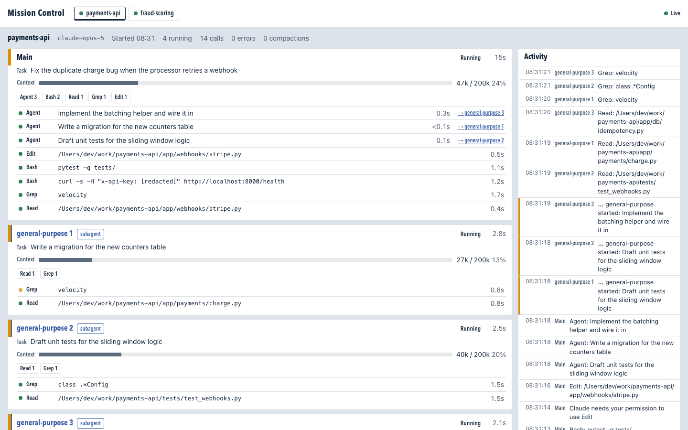

# cc-mission-control

A Claude Code plugin that opens a live local dashboard for your session. It shows every agent working in the session (the main thread and each subagent), what each one is doing, how much of its context window it has used, and every tool call it makes. It runs on your machine, only observes, and never blocks or changes a tool call.



**Quick start:** in Claude Code run `/plugin marketplace add papoveB01/cc-mission-control`, then `/plugin install cc-mission-control@papoveb01`, then start a new session. The dashboard opens at http://127.0.0.1:4317/. Needs Python 3.10+ and [uv](https://docs.astral.sh/uv/) (see Requirements).

A dark theme is included and follows your system setting: [dark screenshot](docs/screenshot-dark.png).

What it shows:

- **Agent lanes.** One lane per agent: the main session first, then running subagents, then finished ones.
- **Context gauge per agent.** Tokens in context versus the model's window, updated after every model turn.
- **Current task per agent.** Your prompt for the main thread; the delegated description for each subagent.
- **Tool calls per agent.** Tool name, one-line summary, status (running, succeeded, failed) and duration. Click a call to see its full input and output, redacted.
- **Tool tally per agent.** Calls by tool name, plus an error count.
- **Session activity feed.** Prompts, tool calls, subagent start and finish, compactions, notifications and failures across all agents.
- **Multiple sessions.** Each Claude Code session on the machine is its own tab.

## Requirements

- Claude Code. Tested with 2.1.287; the minimum supported version has not been established. Background subagents (the default since 2.1.198) are handled.
- Python 3.10 or newer, available on your PATH as `python3`.
- [uv](https://docs.astral.sh/uv/) is recommended. On the first session the launcher uses uv to create the server's virtualenv in the plugin data directory (installing FastAPI and uvicorn), so there is nothing to install by hand and the environment survives plugin updates.
- Without uv, the launcher still works if `fastapi` and `uvicorn` are importable by `python3`. The launcher only checks those two, but `websockets` and `httpx` are needed as well, so install all four: `pip install fastapi uvicorn websockets httpx`. If neither is true, it prints an install hint for uv to stderr and does nothing else; Claude Code is not affected.

You do not need Node. The dashboard is prebuilt and committed to the repository.

## Install

### Manual install (always works)

Inside Claude Code:

```
/plugin marketplace add papoveB01/cc-mission-control
/plugin install cc-mission-control@papoveb01
```

Or from a terminal:

```
claude plugin marketplace add papoveB01/cc-mission-control
claude plugin install cc-mission-control@papoveb01
```

Start a new Claude Code session afterwards. If hooks do not seem to be active, run `/hooks` and check that the plugin's hooks are listed.

### Per project, through `.claude/settings.json`

To have the dashboard travel with a repository, commit this to the project's `.claude/settings.json` (also in [`examples/project-settings.json`](examples/project-settings.json)):

```json
{
  "extraKnownMarketplaces": {
    "papoveb01": {
      "source": {
        "source": "github",
        "repo": "papoveB01/cc-mission-control"
      }
    }
  },
  "enabledPlugins": {
    "cc-mission-control@papoveb01": true
  }
}
```

Two caveats:

- Claude Code reads `extraKnownMarketplaces` from a repository's settings only after you accept the workspace trust dialog for that folder. In an untrusted folder (including `claude -p` runs) the entries are ignored silently.
- Whether `enabledPlugins` installs the plugin automatically depends on your Claude Code version and settings file. If a teammate does not get it, have them run the manual install above.

### What happens on first start

When a session starts, the `SessionStart` hook runs `scripts/launch.py`. It starts the server if one is not already running, sends it the start event, and opens `http://127.0.0.1:4317/` in your browser. The first run can take a few seconds while uv builds the environment; later starts take milliseconds. The browser opens once: further sessions appear as tabs in the open dashboard, and the browser is not opened on `/clear` or compaction restarts.

If no browser opens (remote or SSH session, `CCMC_NO_BROWSER=1`, `CLAUDE_CODE_REMOTE=true`, or no `open`/`xdg-open`), go to http://127.0.0.1:4317/ yourself.

The first start downloads dependencies, so it needs network access. If the dashboard does not appear, wait a minute, start a new session, and check `server.log` in the data directory (`~/.claude/plugins/data/cc-mission-control-papoveb01/`).

The server logs to `server.log` in the plugin data directory (`~/.claude/plugins/data/cc-mission-control-papoveb01/` for a plugin install; `~/.cc-mission-control/` if the launcher runs outside Claude Code). It exits by itself after 30 minutes with no active session and no open dashboard.

### Disable or uninstall

```
claude plugin disable cc-mission-control@papoveb01
claude plugin uninstall cc-mission-control@papoveb01
```

Uninstalling also deletes the plugin's data directory (the virtualenv and `server.log`) unless you pass `--keep-data`.

### Update

```
claude plugin marketplace update papoveb01
claude plugin update cc-mission-control@papoveb01
```

Then start a new session.

## Using the dashboard

- **Tabs.** The header has one tab per Claude Code session, active ones first; ended sessions are dimmed. The most recently started active session is selected by default. Once you pick a tab, the selection stays until you change it. The indicator on the right shows Live, Reconnecting or Offline for the connection to the server.
- **Summary line.** Project name, model, start time, agents running, total calls, total errors and the number of compactions.
- **Lanes.** Each lane has a colored left edge for its status (running, waiting, idle, done, error), the task text, a context gauge, a tool tally and the most recent calls. Finished subagents collapse to one line; click to expand.
- **Context gauge.** Tokens in context against the window. The bar is neutral under 60%, amber from 60% to 80% and red above 80%. It reads "not available" when no transcript has been found for that agent, rather than showing zero. The window is 200,000 tokens unless the model is a 1M model (see `CCMC_CONTEXT_WINDOW`).
- **Call drawer.** Click a call to open its full redacted input, output, error, timestamps and duration in a drawer on the right. Esc closes it.
- **Activity feed.** Newest first, across all agents. Auto-scroll pauses while you scroll. Below 900 px wide it moves under the lanes.
- **Duplicate lanes.** Subagents with the same type get numbered labels (`general-purpose 1`, `general-purpose 2`, ...). A spawn call in the main lane has a link to the lane it created.

Some messages you will see:

- **Launched in background.** Claude Code runs subagents in the background by default, so the `Agent` tool call that spawns one completes right away. The call shows "Launched in background"; the subagent's own lane carries the live status.
- **No result reported (blocked or cancelled).** A tool call fired its start hook but no result ever came, usually because the call was blocked before running (for example by a sandbox) or cancelled. The call is closed as an error when the agent stops. If a late result does arrive, it replaces this and the error count is corrected.
- **Denied.** An auto-mode permission denial. The call is marked as an error with the reason.
- **Interrupted.** A call you interrupted.

## Configuration

All settings are environment variables, read when the server starts.

| Variable | Default | Purpose |
|---|---|---|
| `CCMC_PORT` | `4317` | Default 4317. Changing it requires a modified copy of the plugin (see Port). |
| `CCMC_DATA_DIR` | `$CLAUDE_PLUGIN_DATA`, else `~/.cc-mission-control` | Logs, pid file, virtualenv. |
| `CCMC_CONTEXT_WINDOW` | `200000` | Window used for gauges when the model is not a 1M model. A model ID containing `1m`, or observed usage above the window, switches that agent to 1,000,000. |
| `CCMC_IDLE_MINUTES` | `30` | Shut the server down after this long with no active session and no open dashboard. `0` disables. |
| `CCMC_STALE_MINUTES` | `60` | Mark a session ended after this long with no hook event and no transcript growth (a killed terminal never sends `SessionEnd`). A later event reactivates it. |
| `CCMC_MAX_CALLS` | `500` | Tool calls kept in memory per agent. |
| `CCMC_MAX_FIELD_CHARS` | `4000` | Truncation length for captured inputs and outputs. |
| `CCMC_REDACT_FILE` | unset | Path to a file of extra redaction regexes (see Security and privacy). |
| `CCMC_NO_BROWSER` | unset | `1` = never open the browser automatically. |
| `CCMC_UPSTREAM_URL` | unset | Forward redacted events to this URL. Off by default. |
| `CCMC_UPSTREAM_TOKEN` | unset | Bearer token sent to the upstream. |
| `CCMC_DEV_ORIGINS` | unset | Comma-separated extra allowed `Origin` values, for the Vite dev server only (for example `http://localhost:5173`). |
| `CCMC_LAUNCH_DEADLINE` | `17` | Launcher only. Seconds after which the `SessionStart` launcher gives up and exits 0, so it always finishes inside the hook's 20 second timeout. |

Set these in the environment Claude Code runs in (the launcher passes its environment on to the server), for example in the `env` block of your Claude Code settings or your shell profile.

### Port

The port is fixed at 4317 in v0.1. Claude Code cannot read environment variables or plugin options in an HTTP hook URL, and there is no supported way to override a plugin's hooks, so the URLs in `hooks/hooks.json` are literal. If 4317 is taken by another program, the launcher detects it (via `/health`), logs a message to stderr and does nothing; Claude Code is unaffected. To use another port you must run a modified copy: fork or clone the repo, replace `4317` in all 15 URLs in `hooks/hooks.json`, set `CCMC_PORT` to the same value, and start Claude Code with `claude --plugin-dir <your-clone>`. Do not edit files under `~/.claude/plugins/cache/`; plugin updates overwrite them.

### Organization policies

If you or your organization set `allowedHttpHookUrls` in Claude Code settings, it must include `http://127.0.0.1:4317/*` (or your port) or the HTTP hooks will not run and the dashboard stays empty:

```json
{ "allowedHttpHookUrls": ["http://127.0.0.1:4317/*"] }
```

Entries merge across settings files; once the key is defined, HTTP hooks that match no entry are blocked.

### Windows

`hooks.json` starts the launcher with `python3`, which often does not exist on Windows. Replace `"command": "python3"` with `python` or `py` in the `SessionStart` entry. Make the edit in a fork or a `claude --plugin-dir` clone, not under `~/.claude/plugins/cache/`, which plugin updates overwrite. This has not been tested on Windows by the author.

## Security and privacy

- **Local only.** The server binds to `127.0.0.1` and never to other interfaces. It rejects requests whose `Host` header is not `127.0.0.1:<port>` or `localhost:<port>` (DNS rebinding), and rejects `/hook`, `/api/*` and `/ws` requests carrying a foreign `Origin`, so a web page you visit cannot inject events or read the stream.
- **Nothing leaves your machine** unless you set `CCMC_UPSTREAM_URL`. When set, the server forwards each event, already redacted, with two added fields: `machine_id` (first 12 hex characters of the SHA-256 of the hostname) and `user` (OS username). The hook URLs never change; hooks always post to the local server, which relays.
- **Redaction is best effort.** Every captured string is redacted before it is stored, displayed or forwarded, then truncated. A secret in a format the patterns do not recognize will be visible in the dashboard on your machine. Built-in patterns cover: private key blocks, Anthropic keys (`sk-ant-`), generic `sk-` keys, GitHub tokens (`ghp_`, `gho_`, `ghu_`, `ghs_`, `ghr_`, `github_pat_`), Slack tokens (`xox[abprs]-`), AWS access key IDs (`AKIA` or `ASIA`), Google API keys, JWTs, Bearer tokens, and values following `api_key`, `secret_key`, `secret`, `token`, `password`, `passwd`, `pwd`, `access_key`, `client_secret` or `private_key` with `:` or `=` (the key is kept, the value masked; key names match case-insensitively and accept `-` or `_`, so `api-key` and `API_KEY` both count). Nested objects are walked, and dictionary keys are redacted too. Matches become `[redacted]`.
- **Adding patterns.** Put one Python regular expression per line in a file and point `CCMC_REDACT_FILE` at it. Lines starting with `#` are comments, and invalid regexes are skipped (with a warning in the log). The whole match is replaced with `[redacted]`.

  ```
  # internal token format
  corp_[A-Za-z0-9]{32}
  ```
- **Observe only.** The hooks never return a decision, so the dashboard cannot block, approve, delay or alter a tool call. HTTP hooks have a 2 second timeout, and a connection failure or non-2xx response is non-blocking: if the server is down or hangs, Claude Code carries on unaffected.
- **Import safety.** The launcher starts the server with the plugin data directory as its working directory and with implicit current-directory imports disabled, so a file in the project you are working in cannot shadow the server's imports.

## How it works

```
Claude Code ── SessionStart (command hook) ──► scripts/launch.py ── starts server, opens browser
     │
     ├── 15 HTTP hooks (POST JSON, 2 s timeout) ──► FastAPI server on 127.0.0.1:4317 ── WebSocket /ws ──► dashboard
     │
     └── transcript .jsonl files ◄── transcript tailer (context usage)
```

- **Hooks.** 16 events: one `command` hook (`SessionStart`, which does not support HTTP hooks) and 15 `http` hooks for the rest (`UserPromptSubmit`, `PreToolUse`, `PostToolUse`, `PostToolUseFailure`, `SubagentStart`, `SubagentStop`, `Stop`, `StopFailure`, `Notification`, `PreCompact`, `PostCompact`, `TaskCreated`, `TaskCompleted`, `PermissionDenied`, `SessionEnd`). `/hook` always answers 200 with an empty body, which Claude Code reads as "no decision".
- **Context usage.** Hooks do not report it. The server tails the session transcript (and each subagent's transcript) and sums `input + cache_creation + cache_read + output` tokens from the latest assistant turn. Transcripts are written asynchronously, so a gauge can trail the live turn by a moment.
- **Linking subagents to their lanes.** In order of preference: the spawn call's response (`tool_response.agentId`), then the `agent-<id>.meta.json` file Claude Code writes next to the subagent transcript, then first-in-first-out matching of pending spawn calls by agent type.
- **Updates.** The server keeps state in memory, batches changes every 150 ms and pushes them to the browser over a WebSocket. Nothing is persisted; restarting the server clears the view.

See [`SPEC.md`](SPEC.md) for the full design.

## Development

Layout:

```
.claude-plugin/   plugin.json, marketplace.json
hooks/hooks.json  launcher + HTTP hooks
scripts/          launch.py (SessionStart launcher), simulate.py (fake session generator)
cc_mission_control/  Python package: config, redact, state, transcript, server, static/ (built dashboard)
ui/               React + TypeScript dashboard source (Vite)
tests/            pytest suite
examples/         project-settings.json
```

Server tests:

```
uv run --extra dev pytest -q
```

CI also runs Python 3.10 and 3.12 (`uv run -p 3.10 --extra dev pytest -q` locally).

Dashboard:

```
cd ui
nvm use            # Node 22, see ui/.nvmrc
npm ci
npm run dev        # http://localhost:5173, proxies to the server on 127.0.0.1:4317
```

Start the server with `CCMC_DEV_ORIGINS=http://localhost:5173` so it accepts the dev server's origin. `npm run build` writes the bundle to `cc_mission_control/static/`; commit it. CI rebuilds the bundle and fails if it differs from what is committed, so build with Node 22. `npm test` runs the UI unit tests.

Simulator: posts a fake session (with fake transcripts so the gauges move) to a running server, so you can work on the UI without spending tokens:

```
python3 scripts/simulate.py --agents 3 --failures --sessions 2 --loop
```

Run `python3 scripts/simulate.py --help` for all flags (`--port`, `--speed`, `--keep-open`, `--seed`, `--model`, `--1m` and others).

Testing local changes in Claude Code:

```
claude --plugin-dir .
```

This uses the data directory `~/.claude/plugins/data/cc-mission-control-inline/`.

Releases: bump the version in `.claude-plugin/plugin.json`, `pyproject.toml` and `cc_mission_control/__init__.py` together; CI checks that they match. Claude Code caches plugins by version, so the bump is required for users to receive an update. Tests must not contain credential-shaped string literals; build fake secrets at runtime (see `tests/test_redact.py`).

## Differences from the spec and Claude Code notes

[`SPEC.md`](SPEC.md) Appendix B lists every change made after checking against the live Claude Code hooks documentation. The ones that matter to users:

- **Subagents run in the background.** Since Claude Code 2.1.198 the spawning `Agent` call returns immediately with "Launched in background"; the lane carries the live status. Results come back to the main agent as a `<task-notification>` prompt, which the dashboard logs as "result delivered to Main" instead of treating it as a new task.
- **Blocked calls have no result hook.** A call blocked before it runs fires its start hook but no result hook, hence "blocked or cancelled".
- **`PermissionDenied`** is a sixteenth event, added for auto-mode denials.
- **The subagent meta file is undocumented.** `agent-<id>.meta.json` was observed on Claude Code 2.1.x and could change. The dashboard prefers the documented `agentId` in the spawn response and parses the meta file defensively. If subagent transcripts are not where expected, that subagent's gauge shows "not available".
- **Context size includes output tokens**, matching Claude Code's own `context_tokens` definition. A 1M window is inferred from observed usage when the transcript records the bare model ID.
- **Agent IDs** appear with and without an `agent-` prefix in the docs; both are accepted.
- **A killed terminal** never sends `SessionEnd`, so silent sessions are marked ended after `CCMC_STALE_MINUTES`.
- **Project-level plugin config** needs workspace trust and may not prompt for installation (see Install).
- **Not included in v0.1:** hosted multi-user server, authentication, persistence across restarts, blocking or approving tool calls, cost in dollars (tokens only) and replay of past sessions.

## License

[Elastic License 2.0](LICENSE). Copyright (c) 2026 E&EL Global Inc., the licensor. In plain language (not a substitute for the license text, see [`NOTICE`](NOTICE)):

- You may use, copy, modify and redistribute this software, including inside your company and in your own products.
- You may not provide it to third parties as a hosted or managed service.
- You may not remove or work around license keys or license notices.
